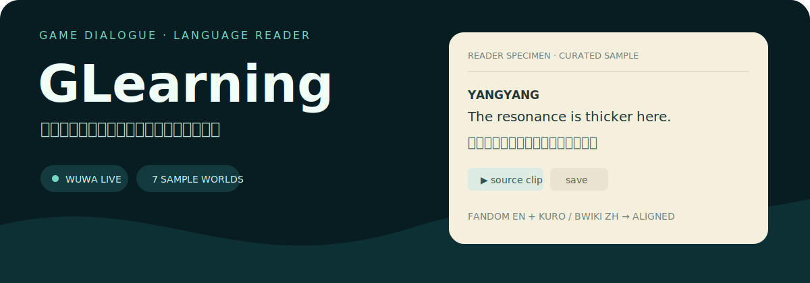

<p align="center">
  
</p>

**GLearning** 把游戏任务台词变成可读、可听、可收藏、可复习的双语学习材料。当前唯一真实连接器是 **《鸣潮》**：Cloudflare Pages Functions 从 Fandom 与 Kuro/BWIKI 获取来源文本、对齐中英台词，并优先使用仓库内已有的来源语音片段。

<p align="center"><strong><a href="https://glearning.pages.dev">打开线上站点</a> · <a href="https://glearning.pages.dev/demo">查看静态功能导览</a></strong></p>

> 其他 7 个游戏页面是明确标注的 **sample reader**：主题、阅读、收藏、复习、TSV 导出与 language help 可用，但没有真实任务连接器，也不伪装成有来源语音。

## 现在能用什么

| 路径 | 数据状态 | 体验 |
|---|---|---|
| `/games/wuwa` | **Live connector** | 中英来源配对、任务目录、来源音频、逐句学习 |
| `/games/genshin` 等 | **Curated sample** | 主题化示例阅读、收藏、复习、导出、language help |
| `/saved` | **Browser-local** | 跨游戏收藏、到期复习、JSON snapshot；无账号/云同步 |
| `/demo` | **Static** | 不请求任务 API、不写收藏/复习存储的评审导览 |

支持的主题页面：`wuwa`、`genshin`、`starrail`、`zzz`、`arknights`、`honkai3`、`cyberpunk`、`witcher3`。

## 一条台词如何进入阅读器

```text
Fandom 英文任务页 ──┐
                    ├─ Cloudflare Function ─ 解析角色/台词/选项 ─ 动态规划对齐 ─ Reader
Kuro / BWIKI 中文页 ─┘                                      └─ 来源音频 / 本地 MP3
```

`/api/quest` 不使用 AI 翻译台词。自动配对流程会：

1. 从 Fandom MediaWiki API 读取英文 wikitext；
2. 从语言元数据提取简体中文标题；
3. 在 Kuro Wiki 主线目录中查找匹配条目，或接受手动 BWIKI/Kuro URL；
4. 解析并允许两侧缺行的动态规划对齐；
5. 返回来源 URL、数量、warning、术语与音频元数据。

## 学习闭环

- **Reader**：说话人、搜索、中文显隐、阅读密度、仅看有音频台词。
- **Study**：收藏台词与术语；本地 key 为 `glearning-saves-v1`。
- **Review**：新收藏立即到期；`Again` 约 10 分钟后再见，`Know` 递增本地间隔；状态在 `glearning-review-v1`。
- **Voice**：免麦克风 shadow practice，只播放已有来源音频并显示确定性分块；跟读次数仅保留在当前会话。
- **Export**：下载 TSV 给 Anki/表格，也可从 `/saved` 导出版本化本地 JSON snapshot。

### 语音能力边界

GLearning **不会**请求麦克风、录音、上传语音、运行语音识别、生成 TTS/新音频或给发音打分。sample reader 没有来源 clip 时，播放入口会明确显示不可用。

账号、profile、云同步、公开进度页和分享卡片也尚未实现。

## 本地运行

要求：Node.js（项目依赖由 `package-lock.json` 固定）。

```bash
git clone <repository-url>
cd GLearning
npm ci
npm run dev
```

`npm run dev` 只启动 Vite 前端；需要测试 `/api/*`、音频和 Cloudflare 路由时使用完整 Pages 环境：

```bash
npm run pages:dev
```

生产构建与本地预览：

```bash
npm run build
npm run preview
```

## API 入口

```text
GET /api/main-quests
GET /api/quest?enUrl=<fandom-url>&zhUrl=auto
GET /api/quest?enUrl=<fandom-url>&zhUrl=<bwiki-or-kuro-url>
```

默认英文来源是 `Utterance of Marvels: I`；当 `zhUrl=auto` 时，函数尝试按简体中文标题解析 Kuro 任务条目。远端来源不可用或未匹配时，响应会带 warning，而不是伪造中文内容。

## 技术结构

```text
src/App.tsx                  路由、落地页、阅读器与 saved library
src/gameData.ts              游戏元数据、connector capability 与 sample 内容
src/storage.ts               收藏、复习与本地 snapshot
src/languageHelp.ts          透明、确定性的本地语言提示
functions/api/quest.js       鸣潮来源解析与双语对齐
functions/api/main-quests.js 主线目录
functions/api/audio.js       来源音频代理
public/audio/                已打包的来源 MP3
```

技术栈：React 19、TypeScript、Vite、Cloudflare Pages / Pages Functions、Wrangler。

## 部署

Wrangler 脚本目标项目名为 `glearning`：

```bash
npm run deploy
```

该命令会先构建再部署。首次使用新的 Cloudflare 账号时，需要先创建 Pages 项目：

```bash
npx wrangler pages project create glearning --production-branch main
```

## 验证清单

```bash
npm run build
grep -RInE 'getUserMedia|MediaRecorder|SpeechRecognition|webkitSpeechRecognition' src functions
```

第二条命令预期无匹配。完整运行时验收应在 `npm run pages:dev` 后检查 `/`、`/demo`、`/saved`、live/sample 游戏路由与两个 API 入口；外部 wiki 数据需要网络。

扩展中文说明仍保留在 [`README.zh-CN.md`](./README.zh-CN.md)。
